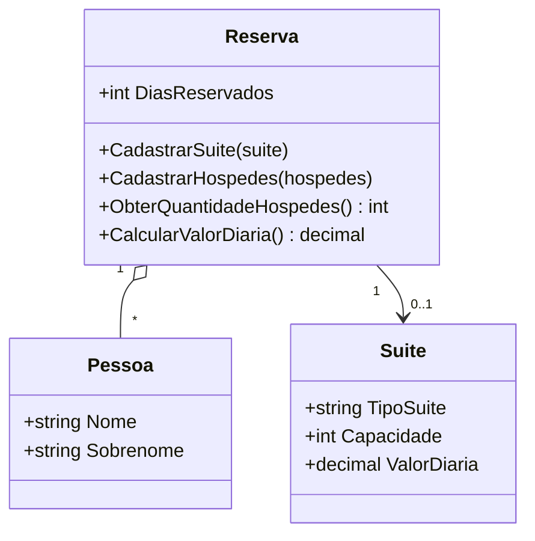

# 🏨 Hotel Reservation System

> **From a DIO C# challenge to a production-minded .NET portfolio project.**

[](https://github.com/matheusflorindo32/dio-hotel-reservation-system/actions/workflows/ci.yml)
[](https://github.com/matheusflorindo32/dio-hotel-reservation-system/actions/workflows/codeql.yml)
[](https://dotnet.microsoft.com/)
[](#-testes)
[](LICENSE)

Sistema de reservas de hospedagem desenvolvido em **C# / .NET 8** a partir do desafio oficial da [DIO — Trilha .NET](https://github.com/digitalinnovationone/trilha-net-explorando-desafio), evoluído com regras de domínio explícitas, testes automatizados, CI, análise estática de segurança e documentação arquitetural.

O objetivo é manter **100% da rastreabilidade educacional do desafio** e, ao mesmo tempo, mostrar como um exercício pequeno pode ser tratado com práticas reais de engenharia sem cair em sobreengenharia.

## ✨ Highlights

- **C# 12 / .NET 8 LTS** com Nullable Reference Types e warnings tratados;
- **Domínio testável** com `Pessoa`, `Suite` e `Reserva`;
- **49 testes automatizados** entre unidade e integração;
- **Testes de fronteira** explícitos para 9, 10 e 11+ dias;
- **GitHub Actions + CodeQL** para build, testes, cobertura e análise estática;
- **ADRs, diagramas, regras e rastreabilidade** requisito → código → teste.

## 📋 Demonstração

```text
Cenário A — 5 dias
Hóspedes: 2
Desconto: não aplicável
Valor total: R$ 750,00

Cenário B — 12 dias
Hóspedes: 3
Desconto: 10% aplicado
Valor total: R$ 3.456,00

Cenário C — capacidade excedida
Reserva rejeitada por exceção de domínio.
```

---

## 🎯 Desafio e requisitos DIO

O sistema relaciona hóspedes (`Pessoa`) e acomodação (`Suite`) por meio de uma `Reserva`, validando capacidade e calculando corretamente o valor da hospedagem.

| ID | Requisito | Status |
|---|---|---|
| DIO-001 | Impedir reserva quando hóspedes > capacidade da suíte | ✅ Implementado |
| DIO-002 | `ObterQuantidadeHospedes()` retorna o total de hóspedes | ✅ Implementado |
| DIO-003 | `CalcularValorDiaria()` = DiasReservados × ValorDiaria | ✅ Implementado |
| DIO-004 | Desconto de 10% para reservas de **10 dias ou mais** | ✅ Implementado |

A matriz completa requisito → implementação → teste está em [docs/requirements-traceability.md](docs/requirements-traceability.md).

> **Decisão normativa:** o material da DIO apresenta divergência entre “maior que 10 dias” e “igual ou maior que 10 dias”. Este projeto adota `>= 10`, conforme as regras detalhadas e o código-base oficial, com justificativa no [ADR-001](docs/adr/ADR-001-regra-desconto.md) e teste explícito de fronteira.

## 🧠 Regras de negócio

| Regra | Descrição |
|---|---|
| RN-001 | Hóspedes não podem superar a capacidade da suíte |
| RN-002 | `ObterQuantidadeHospedes()` retorna a quantidade exata cadastrada |
| RN-003 | `ValorTotal = DiasReservados × ValorDiaria` usando `decimal` |
| RN-004 | `DiasReservados >= 10` → desconto de 10% |
| RN-005 | Dados inválidos são rejeitados com guard clauses/exceções adequadas |

Especificação completa: [docs/business-rules.md](docs/business-rules.md).

## 🏗️ Arquitetura



A solução foi mantida propositalmente pequena: um projeto de domínio, um console demonstrativo e dois projetos de teste. A decisão está documentada no [ADR-002](docs/adr/ADR-002-estrutura-simplificada.md).

```text
dio-hotel-reservation-system/
├── src/
│   ├── HotelReservation.Domain/
│   └── HotelReservation.ConsoleApp/
├── tests/
│   ├── HotelReservation.UnitTests/
│   └── HotelReservation.IntegrationTests/
├── docs/
├── .github/
│   ├── workflows/
│   ├── ISSUE_TEMPLATE/
│   └── pull_request_template.md
└── HotelReservation.sln
```

Mais detalhes: [Arquitetura](docs/architecture.md) · [Diagrama de classes](docs/diagrams/class-diagram.md) · [Fluxo da reserva](docs/diagrams/reservation-flow.md).

## 🧪 Testes

```bash
dotnet test --configuration Release
```

A suíte cobre:

- capacidade abaixo, igual e acima do limite;
- cadastros sucessivos de hóspedes;
- 1, 5, 9, **10**, 11 e 30 dias;
- valores monetários com centavos;
- dados inválidos e ausência de suíte;
- fluxos completos de reserva com e sem desconto.

O caso de **10 dias** é tratado como teste de fronteira obrigatório. A estratégia e os resultados de cobertura estão documentados em [docs/testing-strategy.md](docs/testing-strategy.md).

## ⚙️ CI e segurança

Os workflows ativos ficam em:

- `.github/workflows/ci.yml` — restore, build Release, testes e coleta de cobertura;
- `.github/workflows/codeql.yml` — análise estática C# em push, pull request e agenda semanal.

O CI usa permissões mínimas, e os resultados de cobertura são publicados como artefato da execução. Consulte também [SECURITY.md](SECURITY.md).

## 🔍 What this project demonstrates

- **Object-Oriented Programming** — encapsulamento, invariantes e coleções somente leitura;
- **Domain modeling** — regras de negócio explícitas e rastreáveis;
- **Validation & error handling** — guard clauses e exceções de domínio específicas;
- **Unit & integration testing** — xUnit, boundary testing e fluxos completos;
- **CI & static analysis** — GitHub Actions e CodeQL;
- **Git workflow** — commits semânticos, templates de issue e PR;
- **Architecture documentation** — ADRs, Mermaid, roadmap e matriz de rastreabilidade.

## 🛠️ Tecnologias

- **.NET 8 LTS / C# 12**
- **xUnit**
- **coverlet.collector**
- **GitHub Actions**
- **CodeQL**
- **Mermaid**

## 🚀 Como executar

Pré-requisito: [.NET 8 SDK](https://dotnet.microsoft.com/download).

```bash
git clone https://github.com/matheusflorindo32/dio-hotel-reservation-system.git
cd dio-hotel-reservation-system
dotnet restore
dotnet build --configuration Release
dotnet test --configuration Release
dotnet run --project src/HotelReservation.ConsoleApp
```

## 📚 Documentação técnica

- [Arquitetura](docs/architecture.md)
- [Regras de negócio](docs/business-rules.md)
- [Estratégia de testes](docs/testing-strategy.md)
- [Matriz de rastreabilidade](docs/requirements-traceability.md)
- [Roadmap](docs/roadmap.md)
- [Portfolio review](docs/portfolio-review.md)
- [ADRs](docs/adr/)
- [Diagramas](docs/diagrams/)

## 🚀 Evolução planejada

A V1 permanece intencionalmente focada no domínio e no console. O roadmap documenta uma evolução possível para API ASP.NET Core, EF Core/PostgreSQL, autenticação e, apenas em fases posteriores, um produto SaaS de reservas.

Detalhes: [docs/roadmap.md](docs/roadmap.md).

## 📄 Licença

Distribuído sob a licença MIT. Veja [LICENSE](LICENSE).

## 👤 Autor

**Matheus Florindo de Deus**  
[GitHub](https://github.com/matheusflorindo32) · [LinkedIn](https://www.linkedin.com/in/matheus-florindo-de-deus-b953b017a/)

## 🙏 Créditos

Projeto desenvolvido a partir do desafio educacional [DIO — Trilha .NET · Explorando a linguagem C#](https://github.com/digitalinnovationone/trilha-net-explorando-desafio). Esta versão preserva os requisitos originais e adiciona práticas de engenharia, testes e documentação para fins de estudo e portfólio.
