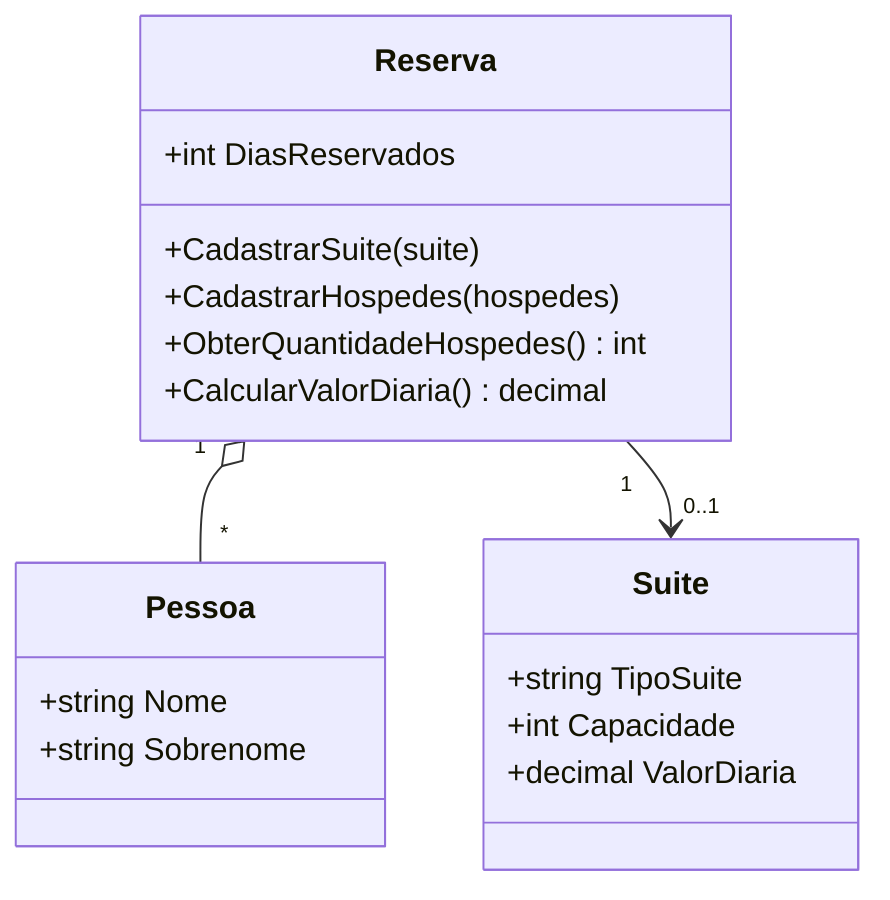

# 🏨 Hotel Reservation System — Desafio DIO (Portfolio Edition)

[](https://github.com/matheusflorindo32/dio-hotel-reservation-system/actions/workflows/ci.yml)
[](https://github.com/matheusflorindo32/dio-hotel-reservation-system/actions/workflows/codeql.yml)
[](https://dotnet.microsoft.com/)
[](#-testes)
[](LICENSE)

Sistema de reservas de hospedagem desenvolvido em C#/.NET a partir do desafio
oficial da [DIO — Trilha .NET](https://github.com/digitalinnovationone/trilha-net-explorando-desafio),
evoluído com testes automatizados, arquitetura limpa, CI e documentação
profissional.

> Este repositório mantém **integralmente** os requisitos educacionais originais
> (Camada A) e adiciona qualidade de engenharia ao redor deles (Camada B), sem
> alterar a lógica obrigatória do desafio.

---

## 📋 Demonstração

Saída real da aplicação console (`dotnet run`):

```text
============================================================
Cenário 1 — Reserva de 5 dias (sem desconto)
============================================================
Suíte: Standard
Hóspedes (2): Ana Silva, Bruno Souza
Dias reservados: 5
Desconto de longa estadia: não aplicável
Valor total: R$ 750,00

============================================================
Cenário 2 — Reserva de 12 dias (desconto de 10%)
============================================================
Suíte: Premium
Hóspedes (3): Carla Mendes, Diego Pereira, Elisa Rocha
Dias reservados: 12
Desconto de longa estadia: 10% aplicado
Valor total: R$ 3.456,00

============================================================
Cenário 3 — Capacidade excedida (exceção de domínio)
============================================================
Reserva rejeitada: A suíte comporta no máximo 2 hóspede(s), mas foram informados 3.
```

## 🎯 O problema

Construir um sistema de hospedagem que relacione hóspedes (`Pessoa`) e acomodação
(`Suite`) por meio de uma `Reserva`, calculando corretamente a quantidade de
hóspedes e o valor da diária, com regras de capacidade e desconto.

## ✅ Requisitos da DIO (Camada A)

| ID | Requisito | Status |
|---|---|---|
| DIO-001 | Impedir reserva quando hóspedes > capacidade da suíte (exception) | ✅ Implementado |
| DIO-002 | `ObterQuantidadeHospedes()` retorna o total de hóspedes | ✅ Implementado |
| DIO-003 | `CalcularValorDiaria()` = DiasReservados × ValorDiaria | ✅ Implementado |
| DIO-004 | Desconto de 10% para reservas de **10 dias ou mais** | ✅ Implementado |

Rastreabilidade completa (requisito → código → teste):
[docs/requirements-traceability.md](docs/requirements-traceability.md).

> **Decisão normativa:** o material da DIO diverge entre "maior que 10 dias" e
> "igual ou maior que 10 dias". Este projeto adota `>= 10`, com justificativa no
> [ADR-001](docs/adr/ADR-001-regra-desconto.md) e teste de fronteira obrigatório.

## 💡 A solução (Camada B)

O desafio resolvido com práticas reais de engenharia:

- **Domínio puro** sem dependências externas, pronto para virar API/produto;
- **Exceções de domínio específicas** (`CapacidadeExcedidaException`,
  `SuiteNaoInformadaException`) em vez de exceções genéricas;
- **49 testes automatizados** (45 unitários + 4 de integração) com xUnit;
- **CI com GitHub Actions** (build + testes em Release, warnings como erros) e
  análise estática com CodeQL;
- **Documentação viva**: regras de negócio, ADRs, diagramas Mermaid e roadmap.

## 🏗️ Arquitetura



Estrutura deliberadamente simples (justificada no
[ADR-002](docs/adr/ADR-002-estrutura-simplificada.md)):

```
dio-hotel-reservation-system/
├── src/
│   ├── HotelReservation.Domain/        # Entidades e regras de negócio
│   └── HotelReservation.ConsoleApp/    # Demonstração executável
├── tests/
│   ├── HotelReservation.UnitTests/         # 45 testes de regras isoladas
│   └── HotelReservation.IntegrationTests/  # 4 testes de fluxo completo
├── docs/                    # Arquitetura, regras, ADRs, diagramas, roadmap
├── .github/                 # Templates de issue/PR (workflows: ver docs/ci/)
└── HotelReservation.sln
```

Detalhes: [docs/architecture.md](docs/architecture.md) ·
[diagrama de classes](docs/diagrams/class-diagram.md) ·
[fluxo da reserva](docs/diagrams/reservation-flow.md).

## 📐 Regras de negócio

| Regra | Descrição |
|---|---|
| RN-001 | Hóspedes não podem superar a capacidade da suíte → `CapacidadeExcedidaException` |
| RN-002 | `ObterQuantidadeHospedes()` retorna a quantidade exata cadastrada |
| RN-003 | `ValorTotal = DiasReservados × ValorDiaria` (com `decimal`) |
| RN-004 | `DiasReservados >= 10` → desconto de 10% (`ValorTotal × 0.90m`) |
| RN-005 | Validações de dados inválidos (dias, capacidade, diária, nulos, listas vazias) |

Especificação completa: [docs/business-rules.md](docs/business-rules.md).

## 🛠️ Tecnologias

- **.NET 8 (LTS)** · C# 12 ([ADR-003](docs/adr/ADR-003-dotnet-8-lts.md))
- **xUnit** + coverlet (testes e cobertura)
- **GitHub Actions** (CI) + **CodeQL** (análise estática)
- Nullable Reference Types, Implicit Usings, warnings como erros
  (`Directory.Build.props`)

## 🚀 Execução

Pré-requisito: [.NET 8 SDK](https://dotnet.microsoft.com/download).

```bash
git clone https://github.com/matheusflorindo32/dio-hotel-reservation-system.git
cd dio-hotel-reservation-system
dotnet restore
dotnet build
dotnet run --project src/HotelReservation.ConsoleApp
```

## 🧪 Testes

```bash
dotnet test
```

**49 testes, todos passando** (verificado em 2026-09-06, SDK 8.0.424):

- Capacidade: abaixo, igual e acima do limite, inclusive cadastros sucessivos;
- Desconto: 1, 5, 9, **10 (fronteira obrigatória)**, 11 e 30 dias;
- Cálculo: valores monetários exatos, incluindo diárias com centavos;
- Validações: todas as entradas inválidas da RN-005;
- Integração: fluxo completo da reserva, com e sem desconto.

Estratégia e cobertura medida (94,5% de linhas, 100% de branches no Domain):
[docs/testing-strategy.md](docs/testing-strategy.md).

## ⚙️ CI

Os workflows de CI (`ci.yml`) e análise estática (`codeql.yml`) estão prontos em
[`docs/ci/`](docs/ci/README.md). **Ativação pendente em um passo manual**: a
publicação automatizada deste repositório usou um token sem o escopo `workflow`,
e o GitHub exige esse escopo para criar arquivos em `.github/workflows/` via API.
As instruções de ativação (≈1 minuto) estão em [docs/ci/README.md](docs/ci/README.md);
após o passo, os badges acima passam a refletir as execuções reais.

## 🔍 What this project demonstrates

- **C# / .NET 8** — código idiomático, moderno e sem warnings;
- **OOP** — encapsulamento, invariantes de construtor, coleções somente leitura;
- **Business rules** — regras explícitas, testáveis e rastreáveis;
- **Unit & integration testing** — xUnit, testes de fronteira, valores exatos;
- **Exception handling** — hierarquia de exceções de domínio;
- **Git / GitHub** — Conventional Commits, templates de issue e PR;
- **GitHub Actions** — workflows de CI e CodeQL prontos (ativação: `docs/ci/`);
- **Documentação** — ADRs, diagramas Mermaid, matriz de rastreabilidade;
- **Arquitetura** — simplicidade deliberada com caminho de evolução documentado.

## 🚀 Melhorias sobre o exercício original

| Original (template DIO) | Este projeto |
|---|---|
| Exception genérica | Exceções de domínio tipadas |
| Sem validação de dados | RN-005: validações com guard clauses |
| Sem testes | 49 testes automatizados |
| Sem CI | Workflows de build + testes + CodeQL prontos |
| Sem documentação técnica | ADRs, regras, diagramas e rastreabilidade |

## 🗺️ Roadmap

V1 (console, atual) → V2 (API) → V3 (PostgreSQL/EF Core) → V4 (SaaS) →
V5 (produção). Detalhes em [docs/roadmap.md](docs/roadmap.md).

## 📝 Decisões técnicas

- [ADR-001](docs/adr/ADR-001-regra-desconto.md) — regra de desconto `>= 10` dias
- [ADR-002](docs/adr/ADR-002-estrutura-simplificada.md) — estrutura simplificada
- [ADR-003](docs/adr/ADR-003-dotnet-8-lts.md) — .NET 8 LTS

## 📄 Licença

Distribuído sob a licença MIT. Veja [LICENSE](LICENSE).

## 👤 Autor

**Matheus Florindo de Deus**
[GitHub](https://github.com/matheusflorindo32) ·
[LinkedIn](https://www.linkedin.com/in/matheus-florindo-de-deus-b953b017a/)

## 🙏 Créditos

Desafio original:
[DIO — Trilha .NET · Explorando a linguagem C#](https://github.com/digitalinnovationone/trilha-net-explorando-desafio).
Este repositório é uma evolução educacional e de portfólio sobre o exercício
proposto, mantendo os créditos à DIO.
