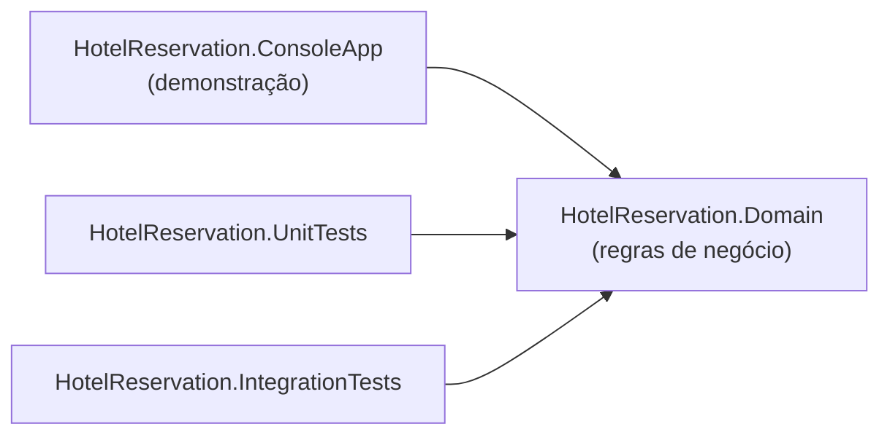

# Arquitetura

## Visão geral

O projeto é uma aplicação console em .NET 8 organizada em duas camadas
conceituais (ver ADR-002):

- **`HotelReservation.Domain`** — núcleo puro: entidades, regras de negócio e
  exceções de domínio. Não depende de nenhum outro projeto nem de pacotes
  externos.
- **`HotelReservation.ConsoleApp`** — camada de apresentação/demonstração.
  Depende apenas do Domain.



## Decisões estruturais

| Decisão | Motivo | Registro |
|---|---|---|
| Duas camadas (Domain + ConsoleApp) | Evita complexidade artificial em projeto pequeno | [ADR-002](adr/ADR-002-estrutura-simplificada.md) |
| .NET 8 LTS | Versão suportada, estável e verificada no ambiente | [ADR-003](adr/ADR-003-dotnet-8-lts.md) |
| Regra de desconto `>= 10` dias | Regra normativa da especificação detalhada da DIO | [ADR-001](adr/ADR-001-regra-desconto.md) |
| `decimal` para valores monetários | Precisão exata em cálculos financeiros | — |
| Exceções de domínio específicas | Erros de negócio distinguíveis de erros técnicos | — |

## Modelo de domínio

O diagrama de classes completo está em
[diagrams/class-diagram.md](diagrams/class-diagram.md) e o fluxo da reserva em
[diagrams/reservation-flow.md](diagrams/reservation-flow.md).

### `Pessoa`

Hóspede da reserva. Apenas `Nome` e `Sobrenome` (minimização de dados pessoais).
Valida entradas obrigatórias no construtor (guard clauses).

### `Suite`

Tipo, capacidade e valor da diária. Invariantes garantidas na criação:
capacidade > 0 e diária >= 0.

### `Reserva`

Agrega hóspedes e suíte. Expõe as operações do desafio:

- `CadastrarSuite(Suite)` / `CadastrarHospedes(IEnumerable<Pessoa>)`
- `ObterQuantidadeHospedes()`
- `CalcularValorDiaria()`

Encapsulamento: a coleção interna de hóspedes é exposta como
`IReadOnlyCollection<Pessoa>`; mutações só ocorrem via métodos de cadastro, que
aplicam as regras RN-001 e RN-005.

### Exceções de domínio

```
Exception
└── DomainException
    ├── CapacidadeExcedidaException   (RN-001)
    └── SuiteNaoInformadaException    (RN-005)
```

Entradas estruturalmente inválidas (nulos, valores fora de faixa no construtor)
usam `ArgumentException`/`ArgumentNullException`; violações de regra de negócio
usam `DomainException` e derivadas.

## Qualidade configurada

Definida em `Directory.Build.props` para todos os projetos:

- Nullable Reference Types e Implicit Usings habilitados;
- `TreatWarningsAsErrors=true` — nenhum warning é tolerado no build;
- `AnalysisLevel=latest` com reforço de estilo via `.editorconfig`.
