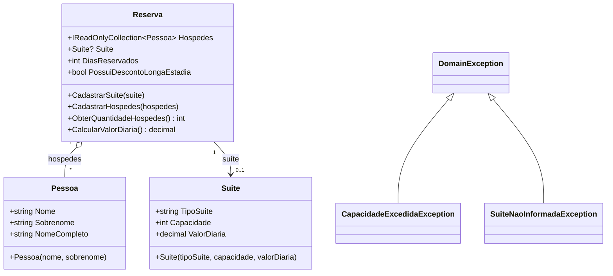

# Diagrama de classes

```mermaid
classDiagram
    class Pessoa {
        +string Nome
        +string Sobrenome
        +string NomeCompleto
        +Pessoa(nome, sobrenome)
    }

    class Suite {
        +string TipoSuite
        +int Capacidade
        +decimal ValorDiaria
        +Suite(tipoSuite, capacidade, valorDiaria)
    }

    class Reserva {
        +IReadOnlyCollection~Pessoa~ Hospedes
        +Suite? Suite
        +int DiasReservados
        +bool PossuiDescontoLongaEstadia
        +CadastrarSuite(suite)
        +CadastrarHospedes(hospedes)
        +ObterQuantidadeHospedes() int
        +CalcularValorDiaria() decimal
    }

    class DomainException
    class CapacidadeExcedidaException
    class SuiteNaoInformadaException

    Reserva "1" o-- "*" Pessoa : hospedes
    Reserva "1" --> "0..1" Suite : suíte
    DomainException <|-- CapacidadeExcedidaException
    DomainException <|-- SuiteNaoInformadaException
```

A `Reserva` é o agregado central: relaciona hóspedes (`Pessoa`) e a acomodação
(`Suite`) e concentra as regras de negócio do desafio.
