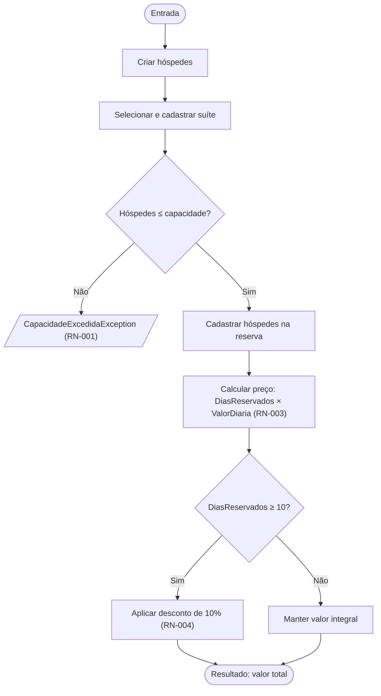

# Fluxo da reserva

```mermaid
flowchart TD
    A([Entrada]) --> B[Criar hóspedes]
    B --> C[Selecionar e cadastrar suíte]
    C --> D{Hóspedes ≤ capacidade?}
    D -- Não --> E[/"CapacidadeExcedidaException (RN-001)"/]
    D -- Sim --> F[Cadastrar hóspedes na reserva]
    F --> G["Calcular preço: DiasReservados × ValorDiaria (RN-003)"]
    G --> H{DiasReservados ≥ 10?}
    H -- Sim --> I["Aplicar desconto de 10% (RN-004)"]
    H -- Não --> J[Manter valor integral]
    I --> K([Resultado: valor total])
    J --> K
```

Pontos de falha tratados (RN-005): dias inválidos no construtor, suíte ausente,
lista de hóspedes nula ou vazia. Detalhes em
[../business-rules.md](../business-rules.md).
